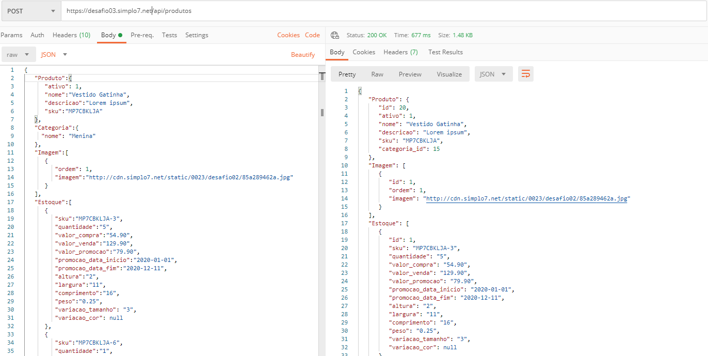

# Desafios Cakephp - 03 - API de Produtos

## Sobre o Desafio

Neste desafio vamos adicionar produtos no nosso sistema através de uma API Rest.

## O que iremos utilizar

A implementação deverá ser obrigatoriamente com o Framework Cakephp. A versão que será utilizada no desafio é opcional:

[Baixar versão 2.4.2 (Versão da Simplo7)](https://bakery.cakephp.org/2013/10/23/CakePHP-2-4-2-released.html)

[Última versão](https://book.cakephp.org/4/en/installation.html)

Banco de dados que iremos utilizar será o Mysql ou MariaDB.

O ambiente para este desenvolvimento é opcional.
Para usuários de Windows, recomendamos a utilização do WampServer
<br/>
[Baixar e realizar a instalação do WampServer](https://www.wampserver.com/en/)

## Especificação da Aplicação

<strong>API</strong>

Criar uma rota na aplicação para o recurso `/api`

Criar um `Controller` produtos que deverá estar acessível na url `/api/produtos` e deve expor uma api REST.
O controller deve implementar as operações para Adicionar, Editar, Listar e Remover produtos.
<br/><br/>
Implementar as validações necessárias para os campos obrigatórios e retornar uma falha caso algum destes campos não seja enviado.
<br/><br/>
Em caso de Sucesso, retornar HTTP 200
<br/><br/>
Em caso de Falha de Validação, retornar HTTP 400
<br/><br/>
Em caso de Erro interno, retornar HTPP 500

<strong>Rotas da API</strong>

- **`POST /api/produtos.json`**: A rota deve receber `nome`, `descricao` e `sku` dentro do corpo da requisição. Além disto, deve receber ainda as informações referentes aos relacionamentos do produto. Um exemplo de `payload` completo encontra-se na pasta `Assets` com o nome de `produto.json`.

```json
{
  "Produto": {
      "nome": "Vestido",
      "descricao": "Lorem ipsum dolor sit amet, consectetur adipiscing elit. Aenean in faucibus libero.",
      "sku": "MP7CBKLJA"
  },
  "Categoria": {},
  "Imagem": [],
  "Estoque": []
}
```

- **`PUT /api/produtos/[ID].json`**: A rota deve permitir alterações no produto e seus relacionamentos, exceto alteração ou inclusão de nova uma variação, ou seja, o objeto `Estoque` não é utilizado neste método. Se forem enviadas imagens no objeto `Imagem`, estas devem substituir todas as imagens existentes.

```json
{
  "Produto": {
    "descricao": "Nova descrição"
  },
  "Imagem": [
  {
    "ordem": 1,
    imagem":"http://cdn.simplo7.net/static/0023/desafio02/nova-imagem.jpg"
  }
  ]
}
```

- **`GET /api/produtos.json`**: Essa rota deve retornar uma listagem com todos produtos cadastrados. Paginar a listagem de 10 em 10 produtos, retornar um objeto `pagination` contendo as informações da pagina atual, total de paginas existentes e o total de produtos cadastrados. Os nomes dos atributos nesta tag são opcionais, exemplo:

```json
{
  "result": [
    {
    "Produto": {
      "nome": "Vestido 1",
      "descricao": "Lorem ipsum dolor sit amet, consectetur adipiscing elit. Aenean in faucibus libero.",
      "sku": "MP7CBKLJA"
    },
    "Categoria": {},
    "Imagem": [],
    "Estoque": []
   },
   "Produto": {
      "nome": "Vestido 2",
      "descricao": "Lorem ipsum dolor sit amet, consectetur adipiscing elit. Aenean in faucibus libero.",
      "sku": "MP7CBKLJA"
   },
   "Categoria": {},
   "Imagem": [],
   "Estoque": []
  ],
  "pagination": {
    "current_page": 1,
    "page_count": 2,
    "count": 42
  }
}
```

- **`DELETE /api/produtos/[ID].json`**: A rota deve receber como parâmetro o `ID` de um produto e realizar sua exclusão. Se for passado um `ID` inexistente, deve retornar uma mensagem e um HTTP 400 como resposta. No corpo desta mensagem não é necessário enviar nada.


<strong>Interface de Usuário</strong>

Criar ou utilizar a interface já implementada no Desafio 02 para listar os produtos, conforme se pede:

- Na listagem, exibir a imagem (Miniatura Gerada), Nome do Produto, SKU, Preço, quantidade total em estoque e o indicador se o produto esta ativo/inativo.
- Paginação dos resultados de 10 em 10 itens.

<strong>Entidades e seus relacionamentos</strong>

- Produto

Principais informações do produto como nome, descrição, preço.

Campos Obrigatórios:
- nome
- quantidade total
- categoria

<strong>Observação 1:</strong> Esta tabela possui uma coluna chamada `importacao_id`, do tipo Texto. Este campo deve obrigatóriamente armazenar o código do produto antigo, ou seja, o seu `id` no sistema que está sendo importado.
<br/><br/>
<strong>Observação 2:</strong> O campo quantidade total deve ser a soma de todas quantidades das variações do produto.

- Produto Estoques

Possui relacionamento 1 para N com a entidade Produto.
Um produto possui várias variações (Estoques).

- Produto Categorias

Possui relacionamento 1 para 1 com a entidade Produto.
Um produto pertence a uma categoria.

- Produto Imagens

Possui relacionamento 1 para N com a entidade de Produto.
Um produto possui várias imagens.

## Template da Aplicação

Para te ajudar neste desafio, na pasta `Assets` está disponível o banco de dados padrão que deverá ser utilizado, bem como o arquivo JSON de exemplo para cadastro de um produto.
<br/>
Criar os relacionamentos entre `Models` respeitando a convenção do Cakephp que você aprendeu nos treinamentos.

## Dicas

- Não fique trancado, em caso de dúvidas fale com alguém da sua Equipe para que ele possa ajudar em alguma solução.

## Exemplos

- **`GET /api/produtos.json`**


<br/><br/>

- **`POST /api/produtos.json`**



<br/><br/>

- **`PUT /api/produtos/[ID].json`**


<br/><br/>

- **`DELETE /api/produtos/[ID].json`**


